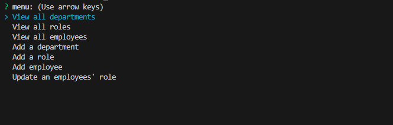
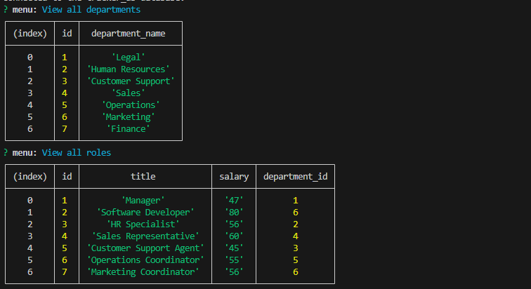
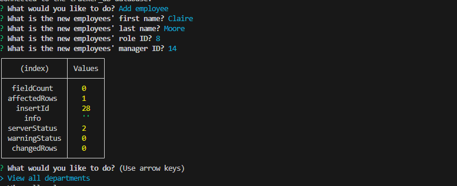

# Chaotic-Employee-Tracked-Down
Chaotic Employee Tracked Down: A Node.js app using Inquirer and MySQL for streamlined organization. Manage departments, roles, and employees effortlessly with an intuitive command-line interface, ensuring effective database interaction for a chaos-free work environment.

## Table of Contents
- [Description](#description)
- [Screenshots](#screenshots)
- [Video Walkthrough](#video-walkthrough)
- [Technologies Used](#technologies-used)
- [Installation](#installation)
- [Features](#features)
- [Usage Information](#usage-information)
- [Contribution Guidelines](#contribution-guidelines)
- [Questions](#questions)

## Description
Embark on the journey of reining in workplace chaos with 'Chaotic Employee Tracked Down.' This innovative Node.js application, powered by Inquirer and MySQL, is designed to empower businesses in wrangling disarray caused by unruly employees. Navigate through the tumultuous world of organizational management, where this command-line tool becomes the beacon for tracking down chaotic elements, bringing order to departments, roles, and employees. With its user-friendly interface, seamlessly view, add, and update data, establishing a harmonious work environment amidst the chaos of unruly employees.

### Screenshots
**Screenshots of application:**

### Video Walkthrough
You can watch the video of this application being used here:
[![Video]](https://drive.google.com/file/d/1AZpYuEeOiCJQayOHS3ZTWwf7VEYzwyXj/view)

## Technologies Used
This project is powered by Node.js, utilizes Inquirer for user prompts, and MySQL for database interaction. It also employs the file system module (node package manager). It also utilizes npm packages such as inquirer@8.2.4 for user prompts and jest for testing.

## Installation
1. Clone the repo: `git clone https://github.com/PotionSela/Chaotic-Employee-Tracked-Down.git`
2. Open in VS Code. If you do not have VS Code, install it.
3. Using the terminal, install Node.js v16.
4. Once Node.js v16 is installed, in the terminal, run the command `npm init -y` to initialize and create a `package.json` where project files will be stored.
5. Next, use the terminal to run the command `npm i` to install the dependencies associated with this application. Developers may need to install inquirer@8.2.4 and jest directly from the command line. To do so, the command for inquirer will be `npm i inquirer@8.2.4`, and `npm i jest` to install the latest version of jest.
6. To run the application, within the terminal, type the command `node server.js`.

## Features
view all departments, roles, and employees, add new departments, roles, and employees, update employee roles, and additional functionality such as updating employee managers, viewing employees by manager, viewing employees by department, deleting departments, roles, and employees, and calculating and displaying the total utilized budget of a department.

## Usage Information
To run this application, use the command line to navigate to the directory of the application, install all dependencies (`npm i`), then type the command `node server.js`. You will then be taken through a series of questions. Once you've provided the necessary input, the application will execute the corresponding actions, allowing you to manage your employee database effectively.

## Contribution Guidelines
Open to collaboration. If you choose to do so, open an issue and modify any changes you would like to see on a feature branch and wait for approval before merging to the main branch.

## Questions
Have additional questions? [Contact me through my GitHub account](https://github.com/PotionSela) or email me at giselamata27@gmail.com.